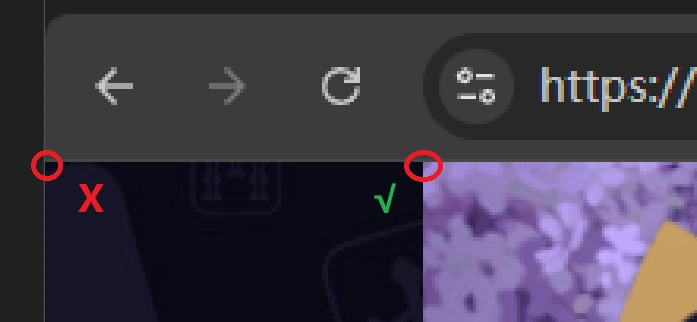
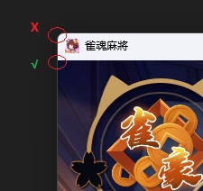
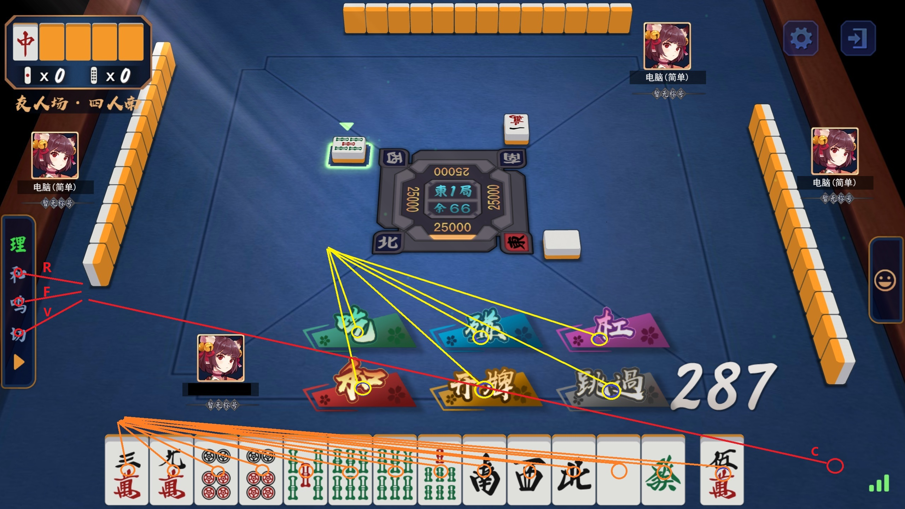
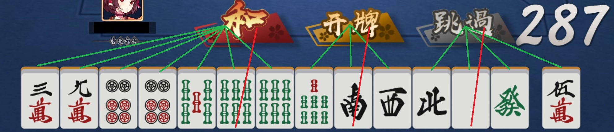

# 使用键盘代替鼠标操作游玩雀魂麻将

## 使用说明

### 开场说明

本程序只适用于 16:9 尺寸游戏画面的情况(默认是 2K)

1. 3840x2160 全屏 (4K)
2. 2560x1440 全屏 (2K)
3. 1920x1080 全屏 (1K)
4. 自定义分辨率 (高级, 可以窗口化但仍然只能是 16:9 格式)

第4项比较麻烦, 详细说明在后面

### 键位说明

- WASD: 上左下右
- E: 鼠标点击左键
- Q: 鼠标点击右键(客户端的过牌/摸切)
- R: 快速点击"自动和牌"(之后位置复原, 下同)
- F: 快速点击"不吃碰杠"
- V: 快速点击"自动拔北"
- C: 快速点击"确认"(右下角)
- Z: 快速点击"自动摸切"
- F12: 暂停功能
- ESC: 退出程序

## 启动方式

### 运行可执行文件

打包程序用的 pyinstaller, 目前只有 windows 平台的 exe 文件, 请前往 [Releases](https://github.com/Fat-pig-Cui/keyboard-majsoul/releases) 界面下载

### 从源码启动

1. 安装 pynput (如已安装可跳过): `pip install pynput`
2. 运行 [main.py](main.py): `python main.py`

## 自定义分辨率详细说明

1. 打开雀魂, 将雀魂窗口调整到最适合你游玩的位置, 要求将画面完整展现在屏幕上'
2. 全屏幕截图(如 PrintScreen 键, 如有多个屏幕只截取含有雀魂界面的显示器的完整屏幕)
3. 打开 Windows 自带的画图, Ctrl V 粘贴(如用的是其他截图工具, 则使用画图打开保存截图
4. 在画图的左下角会显示鼠标当前位置像素的坐标, 记录下面两个顶点的坐标(需要足够精准, 可以按右下角的放大)
   1) 顶点1: 雀魂画面界面矩形(不含窗口边框)的左上角
   2) 顶点2: 雀魂画面界面矩形(不含窗口边框)的右下角

两种可能会选错坐标的典型示例

1. 
2. 

## 鼠标可能位置大致分布

- 红色表示只会出现一瞬间, 瞬时点击
- 橙色是选牌, 可以用 AD 键左右选牌, 然后用 E 键单击, 也可以用 W 键跳到选按钮
- 黄色是选按钮, 可以用 WASD 选按钮, 然后用 E 键单击, 当鼠标在下排按钮时, 按 S 键可以跳到选牌

## 关于按钮与牌之间切换的逻辑

从牌跳转到按钮是固定的, 如下图绿线对应关系

而从按钮跳转到牌, 会记忆上次从什么牌跳转到该按钮, 默认情况是下图红线

## Changelog of Releases

- v1.0.2: 添加自定义分辨率; 更改二进制文件名称; 变量名缩减
- v1.0.1: 添加左侧边栏"自动拔北"; 优化按钮位置; 优化按钮与牌之间切换的逻辑
- v1.0.0: initial release
